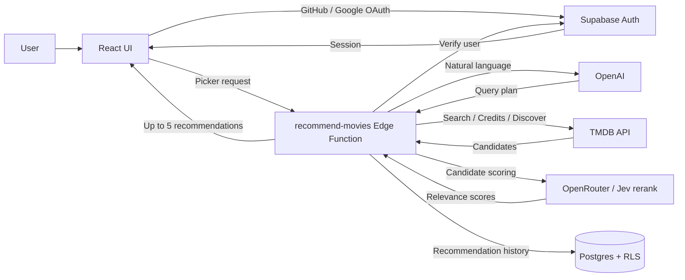

# 🍿 Movie Picker

[繁體中文](./README.md) | [English](./README.en.md) | [日本語](./README.ja.md)

> “Tired of watching the same movies? What else might you enjoy?”

Tell Movie Picker what mood you are in and what you would like to watch. AI turns your request into validated search criteria, then uses the TMDB Discover API to recommend movies or TV shows.

The frontend is built with React. Supabase handles sign-in, the database, and the Edge Function; TMDB and OMDb provide movie data, OpenAI interprets each request, and OpenRouter provides semantic relevance scoring and ordering through Jev rerank.

#### 👀 Take a peek at [Movie Picker](https://movie-picker.peiwang.dev/)

## Features

- **Latest & Trending**: Browse the latest, weekly trending, popular, top-rated, and genre lists for movies and TV shows
- **Search**: Find movies and TV shows, then view details, cast, trailers, seasons, and episode counts
- **AI Picker**: Describe what you want to watch and any limits; OpenAI plans the query, TMDB supplies candidates, and Jev rerank filters and orders up to 5 recommendations. Anonymous trials and saved history after sign-in are supported
- **History**: View the latest 20 AI recommendation runs and delete individual entries
- **Wishlist**: Save movies and TV shows for later
- **User Sign-in**: Sign in with GitHub or Google to use the AI picker, sync your wishlist, and save recommendation history
- **Localization**: Switch between English and Traditional Chinese; responsive layouts support different screen sizes

|   feature    |             screenshot             |
| :----------: | :--------------------------------: |
| movie detail |  |
|   History    |      |
|   Wishlist   |    |

## Tech Stack

| Framework      | Used for                                                |
| -------------- | ------------------------------------------------------- |
| React 19       | Frontend UI                                             |
| TypeScript     | Static type checking                                    |
| Vite           | Local development and frontend builds                   |
| Tailwind CSS 4 | Responsive layouts and styling                          |
| shadcn/ui      | Reusable UI components                                  |
| Motion         | UI animation and reduced-motion support                 |
| React Router   | SPA routing                                             |
| TanStack Query | API fetching, caching, and server-state synchronization |
| Zustand        | Language, auth, and wishlist state                      |
| i18next        | English and Traditional Chinese localization            |
| Zod            | AI response and query-plan validation                   |
| Supabase       | User data, OAuth, RLS, and the Edge Function            |
| TMDB API       | Movie and TV search, discovery, and metadata            |
| OMDb API       | External movie ratings                                  |
| OpenAI         | TMDB query plans through tool calling                   |
| OpenRouter     | Jev rerank: semantic relevance scoring and ordering     |

## Data & Persistence

| Data                      | Storage                                                                   | Purpose                                                        |
| ------------------------- | ------------------------------------------------------------------------- | -------------------------------------------------------------- |
| Wishlist                  | Browser `localStorage` while signed out; synced to Supabase after sign-in | Keeps saved movies and TV shows available across devices       |
| AI recommendation history | Supabase                                                                  | Stores picker criteria, recommendation results, and timestamps |
| User identity             | Supabase Auth                                                             | Supports GitHub and Google sign-in                             |

Row Level Security ensures signed-in users can access only their own wishlist and recommendation history.

## Architecture

- `src/pages` contains routed pages; `src/components` contains shared UI and feature components.
- `src/hooks` coordinates server state; `src/services` keeps external APIs behind clear boundaries.
- `src/stores` manages client state; `supabase/migrations` and `supabase/functions` contain backend behavior.

## Recommendation Pipeline

OpenAI produces a query plan through `plan_movie_search` tool calling. The Supabase Edge Function validates it and fetches TMDB candidates, then Jev rerank filters and orders them by semantic relevance, returning up to 5 titles. Explicit constraints stay in place; total scoring failure falls back to the original candidate order, and history is written in the background.

See [AI Picker Architecture](./docs/supabase-ai-rollout.en.md) for data flow and access control, and [Jev rerank Implementation](./docs/changes/2026-09-24-openrouter-jev-rerank.md) for scoring and fallback rules.

## Develop

Set frontend environment variables from `.env.example`. Store the OpenAI/OpenRouter/TMDB keys for `recommend-movies` and the TMDB/OMDb keys for `media-detail` in Supabase Edge Function Secrets. `media-detail` serves signed-out visitors too; the OMDb key is optional, and external ratings are hidden without it. For local Functions, put `TMDB_ACCESS_TOKEN` and optional `OMDB_API_KEY` in the untracked `supabase/functions/.env`.

For full local testing, start Docker Desktop, provide `OPENAI_API_KEY`, `OPENAI_BASE_URL`, `OPENAI_MODEL`, `OPENROUTER_API_KEY`, and `TMDB_ACCESS_TOKEN` (or `VITE_TMDB_ACCESS_TOKEN`) in an env file, then run `bun --env-file=/path/to/.env.local run dev:local`. The script starts local Supabase, both Edge Functions, and Vite, and connects the frontend to the local API. Open `http://127.0.0.1:5174` and choose “Local test sign-in” to test recommendations and history. Ctrl+C stops the dev servers; `supabase stop` stops the local stack. This does not change the remote Supabase project.

To test only the recommendation core, run `bun --env-file=/path/to/.env.local run test:ai-live`. It calls OpenAI, TMDB, and OpenRouter directly without Supabase, sign-in, or database access.

| Command                   | Purpose                                                    |
| ------------------------- | ---------------------------------------------------------- |
| `bun install`             | Install dependencies                                       |
| `bun run dev:local`       | Start the isolated local frontend, Supabase, and Functions |
| `bun run dev`             | Start the local development server                         |
| `bun run test:run`        | Run all tests                                              |
| `bun run test:ai-live`    | Test AI and TMDB locally with token costs                  |
| `bun run lint`            | Run code checks                                            |
| `bun run build`           | Type-check and build the production bundle                 |
| `bun run deploy:supabase` | Deploy all Edge Functions                                  |

## CI and deployment

GitHub Actions runs lint, Prettier, and tests on every push and pull request targeting `master`. After the checks pass on `master`, it applies Supabase migrations and deploys Edge Functions. Vercel's Git integration automatically deploys frontend Preview and Production builds.

Supabase CD requires the GitHub `SUPABASE_ACCESS_TOKEN` and `SUPABASE_DB_PASSWORD` secrets and uses the `production` environment. Before its first run, confirm that the remote migration history matches the repository.
