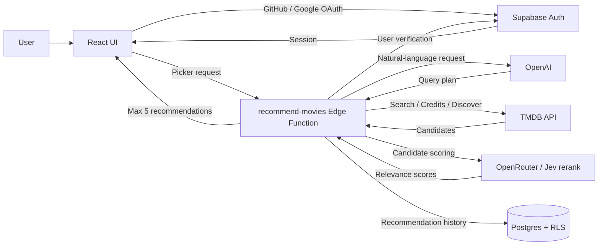

# 🍿 Movie Picker

[繁體中文](./README.md) | [English](./README.en.md) | [日本語](./README.ja.md)

> 「いつも同じ作品ばかり観てしまう。まだ知らない、自分に合う作品を見つけたい。」

今の気分や観たい作品の条件を入力すると、AI が自然言語を検証可能な検索条件に整理し、TMDB Discover API を使って映画やドラマを提案します。

フロントエンドは React で構築し、認証、データベース、Edge Function に Supabase を使用しています。作品情報は TMDB／OMDb から取得し、OpenAI が検索条件を解釈します。OpenRouter の Jev rerank で候補の意味的な関連性を評価し、並べ替えます。

#### 👀 [Movie Picker を試す](https://movie-picker.peiwang.dev/)

## Feature

- **最新・トレンド**：映画とドラマの新着、週間トレンド、人気、高評価、ジャンル別リストを閲覧
- **作品検索**：映画／ドラマを検索し、詳細、キャスト、予告編、シーズン数、エピソード数を表示
- **AI Picker**：観たい作品と条件を自然文で入力。OpenAI が query plan を作成し、TMDB の候補を Jev rerank で絞り込み、並べ替えて最大 5 作品を推薦。匿名での試用と、ログイン後の履歴保存に対応
- **History**：最新 20 件の AI 推薦履歴を表示し、1 件ずつ削除
- **Wishlist**：後で観たい映画やドラマを保存
- **ユーザーログイン**：GitHub／Google OAuth に対応。AI Picker、Wishlist の同期、推薦履歴の保存が可能
- **Localization**：英語／繁体字中国語と responsive layout に対応

|   feature    |             screenshot             |
| :----------: | :--------------------------------: |
| movie detail |  |
|   History    |      |
|   Wishlist   |    |

## Tech Stack

| Framework      | 用途                                             |
| -------------- | ------------------------------------------------ |
| React 19       | Frontend UI                                      |
| TypeScript     | 静的型チェック                                   |
| Vite           | Local development と frontend build              |
| Tailwind CSS 4 | Responsive layout と styling                     |
| shadcn/ui      | 再利用可能な UI component                        |
| Motion         | UI animation と reduced-motion support           |
| React Router   | SPA routing                                      |
| TanStack Query | API fetching、cache、server state の同期         |
| Zustand        | 言語、auth、Wishlist state の管理                |
| i18next        | 英語と繁体字中国語の localization                |
| Zod            | AI response と query plan の validation          |
| Supabase       | User data、OAuth、RLS、Edge Function             |
| TMDB API       | 映画・ドラマの search、Discover、metadata        |
| OMDb API       | 映画の外部 rating を取得                         |
| OpenAI         | tool calling による TMDB query plan の生成       |
| OpenRouter     | Jev rerank：候補の意味的な関連性の評価と並べ替え |

## Data & Persistence

| Data                      | Storage                                                             | 用途                                 |
| ------------------------- | ------------------------------------------------------------------- | ------------------------------------ |
| Wishlist                  | 未ログイン時は browser `localStorage`、ログイン後は Supabase と同期 | 保存した映画やドラマを複数端末で保持 |
| AI recommendation history | Supabase                                                            | 検索条件、推薦結果、作成日時を保存   |
| User identity             | Supabase Auth                                                       | GitHub／Google ログインを管理        |

Cloud data は Row Level Security で保護され、ログイン済みのユーザーは自分の Wishlist と推薦履歴のみにアクセスできます。

## Architecture

- `src/pages` に route ごとの page、`src/components` に shared UI と feature component を配置しています。
- `src/hooks` で server state を扱い、`src/services` で external API access を分離しています。
- `src/stores` で client state、`supabase/migrations` と `supabase/functions` で backend behavior を管理しています。

## Recommendation Pipeline

OpenAI が `plan_movie_search` の tool calling で query plan を生成し、Supabase Edge Function が検証して TMDB の候補を取得します。Jev rerank で意味的な関連性に基づいて絞り込み、並べ替え、最大 5 作品を返します。明示された条件は保持し、評価がすべて失敗した場合は元の候補順にフォールバックします。推薦履歴はバックグラウンドで保存します。

データフローと権限設計は [AI Picker Architecture](./docs/supabase-ai-rollout.en.md)、評価ルールとフォールバックは [Jev rerank 実装説明](./docs/changes/2026-09-24-openrouter-jev-rerank.md)（いずれも English）を参照してください。

## Develop

Frontend の environment variables は `.env.example` を参照して設定します。`recommend-movies` 用の OpenAI／OpenRouter／TMDB key と `media-detail` 用の TMDB／OMDb key は Supabase Edge Function Secrets に保存してください。`media-detail` は未ログインでも使用できます。OMDb key は任意で、設定がない場合は外部評価を表示しません。Local の Function 用に `TMDB_ACCESS_TOKEN` と任意の `OMDB_API_KEY` を追跡対象外の `supabase/functions/.env` に設定します。

Frontend と Edge Function を本機で一緒に試す場合は Docker Desktop を起動し、環境ファイルに `OPENAI_API_KEY`、`OPENAI_BASE_URL`、`OPENAI_MODEL`、`OPENROUTER_API_KEY`、`TMDB_ACCESS_TOKEN`（または `VITE_TMDB_ACCESS_TOKEN`）を用意して、`bun --env-file=/path/to/.env.local run dev:local` を実行します。Local Supabase、`recommend-movies`、Vite が起動し、Frontend は Local API に接続します。`http://127.0.0.1:5174` で「Local test sign-in」を選ぶと推薦と履歴を手動で試せます。Ctrl+C で開発サーバーを終了し、`supabase stop` で Local stack を停止できます。Remote project は変更しません。

推薦ロジックだけを試す場合は `bun --env-file=/path/to/.env.local run test:ai-live` を実行します。Supabase、login、database を経由せず、OpenAI、TMDB、OpenRouter を直接呼び出します。

| Command                   | 用途                                           |
| ------------------------- | ---------------------------------------------- |
| `bun install`             | 依存 package をインストール                    |
| `bun run dev`             | Local development server を起動                |
| `bun run dev:local`       | Local Frontend、Supabase、Function を起動      |
| `bun run test:run`        | すべての test を実行                           |
| `bun run test:ai-live`    | AI と TMDB を Local で実測し token cost を表示 |
| `bun run lint`            | Lint を実行                                    |
| `bun run build`           | Type check 後、production bundle を生成        |
| `bun run deploy:supabase` | すべての Edge Functions を deploy              |

## CI とデプロイ

GitHub Actions はすべての push と `master` 向けの PR で lint、Prettier、test を実行します。`master` の check が成功すると Supabase migration を適用し、Edge Function をデプロイします。Frontend の Preview／Production は Vercel の Git 連携で自動デプロイします。

Supabase CD には GitHub の `SUPABASE_ACCESS_TOKEN` と `SUPABASE_DB_PASSWORD` secrets が必要で、`production` environment を使用します。初回実行前に remote の migration history と repository の一致を確認してください。
