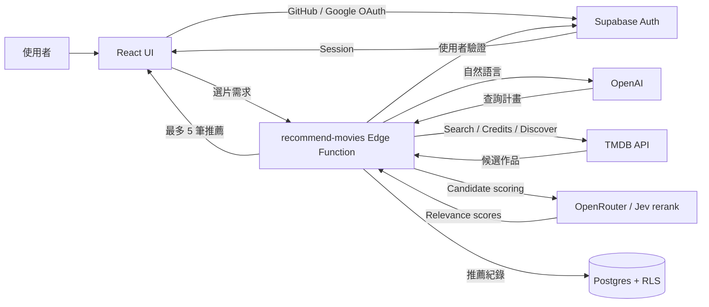

# 🍿 Movie Picker

[繁體中文](./README.md) | [English](./README.en.md) | [日本語](./README.ja.md)

> 「看的電影總是那幾部？有沒有其他我沒聽過、或許很適合我的片單？」

讓 Movie Picker 提供給你幾個電影提案吧！
輸入**此刻心情、想看的電影描述**，由 AI 將自然語言整理成可驗證的查詢條件，再透過 TMDB Discover API 推薦電影或影集。

此專案使用 React 建立前端，由 Supabase 提供登入、資料庫與 Edge Function；電影資料來自 TMDB／OMDb，OpenAI 負責解析使用者的選片需求，OpenRouter 提供 Jev rerank 語意相關性評分與排序。

#### 👀 Take a peek at <u>[Movie Picker](https://movie-picker.peiwang.dev/)</u>

## Feature

- **最新趨勢**：切換電影與影集的最新、每週趨勢、熱門、高評分及各種類型
- **電影搜尋**：搜尋電影／影集，查看詳情、演員、預告片、影集季數與總集數
- **AI 選片**：以自然文字描述期待與限制，OpenAI 規劃查詢、TMDB 取得候選，再透過 Jev rerank 篩選與排序，最多推薦 5 部作品；支援匿名試用與登入後保存紀錄
- **History**：需登入使用，AI 選片歷史紀錄，最多載入 20 筆，支援單筆刪除
- **Wishlist**：電影願望清單
- **使用者登入**：支援 GitHub／Google OAuth；登入後可使用 AI 選片、同步收藏並保存推薦紀錄
- **Localize**：支援英文／繁體中文，RWD 支援各裝置大小

|   feature    |             screenshot             |
| :----------: | :--------------------------------: |
| movie detail |  |
|   History    |      |
|   Wishlist   |    |

## Tech Stack

| Framework      | Used for                                |
| -------------- | --------------------------------------- |
| React 19       | Frontend interface library              |
| TypeScript     | Static type checking                    |
| Vite           | 本機開發與前端建置                      |
| Tailwind CSS 4 | CSS style                               |
| shadcn/ui      | Reusable UI components                  |
| Motion         | UI 動畫與降低動態效果支援               |
| React Router   | SPA routing                             |
| TanStack Query | API 資料取得、快取與伺服器狀態同步      |
| Zustand        | 管理語言、登入與收藏狀態                |
| i18next        | localization                            |
| Zod            | 驗證 AI API 資料與查詢計畫              |
| Supabase       | 使用者資料、OAuth、RLS 與 Edge Function |
| TMDB API       | 搜尋、瀏覽與顯示電影及影集資料          |
| OMDb API       | 取得電影外部評分                        |
| OpenAI         | 透過 tool calling 產生 TMDB query plan  |
| OpenRouter     | Jev rerank：候選的語意相關性評分與排序  |

## Data & Persistence

| 資料        | 保存位置                                                 | 用途                             |
| ----------- | -------------------------------------------------------- | -------------------------------- |
| 收藏清單    | 未登入時使用瀏覽器 `localStorage`；登入後同步至 Supabase | 跨裝置保留想看的電影與影集       |
| AI 推薦紀錄 | Supabase                                                 | 保存選片條件、推薦結果及產生時間 |
| 使用者身分  | Supabase Auth                                            | 支援 GitHub／Google 登入         |

所有雲端資料均受 Row Level Security 保護，登入使用者只能存取自己的收藏與推薦紀錄

## Architecture

- `src/pages` 管理路由頁面，`src/components` 放共用 UI 與功能元件。
- `src/hooks` 協調伺服器狀態，`src/services` 隔離外部 API。
- `src/stores` 管理前端狀態，`supabase/migrations` 與 `supabase/functions` 管理後端行為。

## Recommendation Pipeline

OpenAI 透過 `plan_movie_search` tool calling 產生 query plan，由 Supabase Edge Function 驗證並取得 TMDB 候選；Jev rerank 再依語意相關性篩選、排序，最多回傳 5 部作品。使用者的硬性條件會保留，全部評分失敗時使用原候選順序備援，推薦紀錄於背景寫入。

資料流與權限設計請見 [AI 選片架構](./docs/supabase-ai-rollout.md)；評分規則與備援機制請見 [Jev rerank 實作說明](./docs/changes/2026-09-24-openrouter-jev-rerank.md)（English）。

## Develop

前端環境變數依照 `.env.example` 設定；`recommend-movies` 使用的 OpenAI／OpenRouter／TMDB 金鑰，以及 `media-detail` 使用的 TMDB／OMDb 金鑰，需另外放在 Supabase Edge Function Secrets。`media-detail` 可讓未登入使用者查看電影與影集詳情；OMDb 金鑰可選，缺少時不顯示外部評分。本機執行 Function 時，將 `TMDB_ACCESS_TOKEN`、`OMDB_API_KEY`（可選）放在未追蹤的 `supabase/functions/.env`。

完整本機測試：先啟動 Docker Desktop，確認環境檔有 `OPENAI_API_KEY`、`OPENAI_BASE_URL`、`OPENAI_MODEL`、`OPENROUTER_API_KEY` 與 `TMDB_ACCESS_TOKEN`（或 `VITE_TMDB_ACCESS_TOKEN`），再執行 `bun --env-file=/path/to/.env.local run dev:local`。腳本會啟動本機 Supabase、兩個 Edge Functions 與 Vite，並自動使用本機 API URL/key。開啟 `http://127.0.0.1:5174`，選「本機測試登入」即可手動測推薦與歷史紀錄。按 Ctrl+C 結束兩個開發伺服器；本機 Supabase 可另以 `supabase stop` 停止。此流程不會修改遠端 Supabase 專案。

若只要直接測推薦核心，可執行 `bun --env-file=/path/to/.env.local run test:ai-live`。此指令會直接呼叫 OpenAI、TMDB 與 OpenRouter，略過 Supabase、登入與資料庫。

| 指令                      | 用途                                    |
| ------------------------- | --------------------------------------- |
| `bun install`             | 安裝依賴                                |
| `bun run dev`             | 啟動本機開發環境                        |
| `bun run dev:local`       | 啟動本機前端、Supabase 與 Edge Function |
| `bun run test:run`        | 執行全部測試                            |
| `bun run test:ai-live`    | 本機實測 AI 與 TMDB，輸出 token 與成本  |
| `bun run lint`            | 檢查程式碼                              |
| `bun run build`           | 型別檢查並建立 production bundle        |
| `bun run deploy:supabase` | 部署所有 Edge Functions                 |

## CI/CD

GitHub Actions 會在每次 push 與 PR 執行 lint、測試、build 及 Supabase migration 檢查。PR 通過後部署 Vercel Preview；合併至 `master` 後依序套用 Supabase migrations、部署所有 Edge Functions，再部署 Vercel Production。

請在 GitHub repository secrets 設定 `VERCEL_TOKEN`、`VERCEL_ORG_ID`、`VERCEL_PROJECT_ID`、`SUPABASE_ACCESS_TOKEN` 與 `SUPABASE_DB_PASSWORD`。正式部署使用 GitHub `production` environment，可在該 environment 加上人工審核規則。
